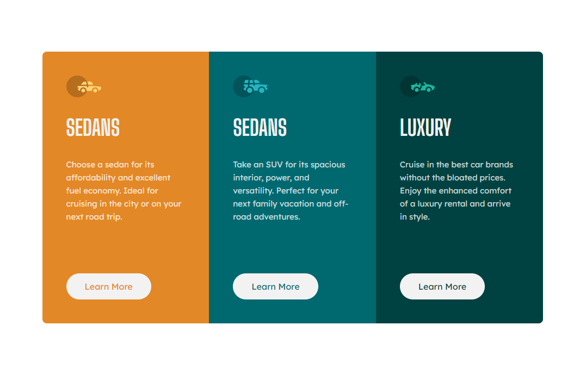

# Frontend Mentor - 3-column preview card component solution

This is a solution to the [3-column preview card component challenge on Frontend Mentor](https://www.frontendmentor.io/challenges/3column-preview-card-component-pH92eAR2-). Frontend Mentor challenges help you improve your coding skills by building realistic projects.

## Table of contents

- [Overview](#overview)
  - [The challenge](#the-challenge)
  - [Screenshot](#screenshot)
  - [Links](#links)
- [My process](#my-process)
  - [What I learned](#what-i-learned)

## Overview

### The challenge

Users should be able to:

- View the optimal layout depending on their device's screen size
- See hover states for interactive elements

### Screenshot

### Links

- Solution URL: [Github](https://github.com/michael-truscott/frontendmentor-3columnpreviewcard)
- Live Site URL: [Github Pages](https://michael-truscott.github.io/frontendmentor-3columnpreviewcard/)

## My process

### What I learned

Notes to self:

- Use `overflow: hidden;` on parent to prevent child's background from escaping border-radius.
- Remember to unset desktop-specific hard-coded container heights when defining mobile styles.
